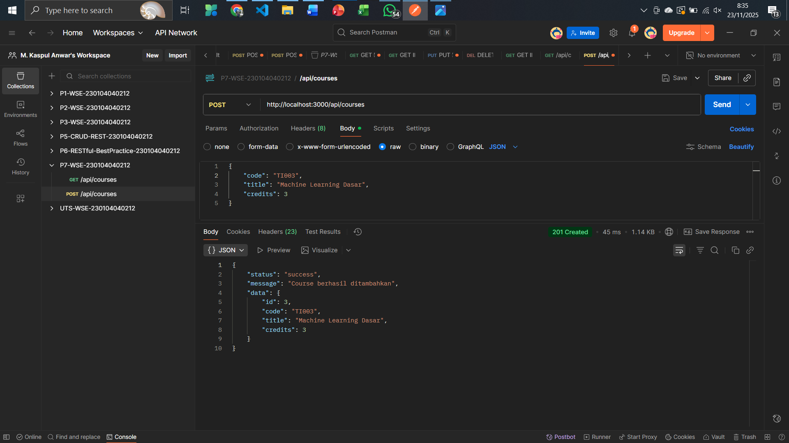
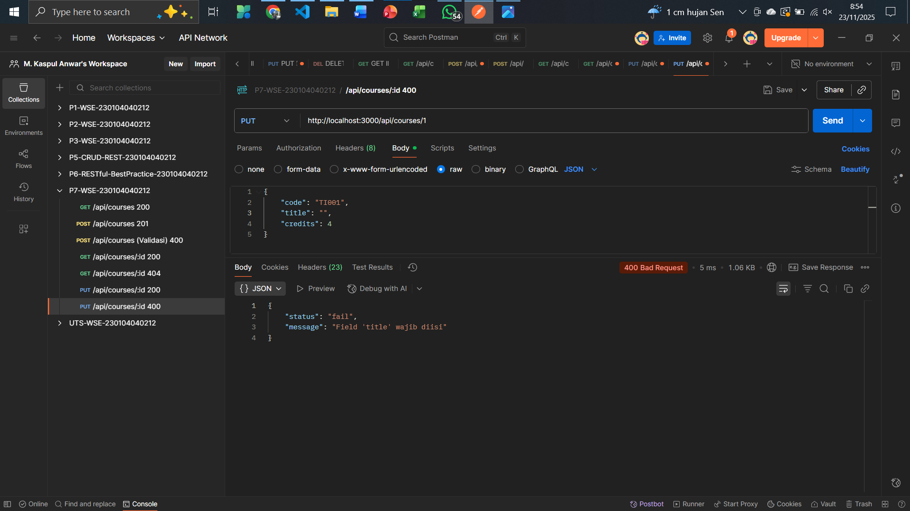

# RESTful API Hardening & Observability (Praktikum 7)

## Project Overview
Proyek ini merupakan kelanjutan dari hasil UTS (Web Service Engineering) dengan penambahan fitur Keamanan (Hardening) dan Observabilitas (Observability) sesuai dengan Modul Praktikum 7. API ini dibangun menggunakan Node.js dan Express.js dengan resource utama `courses`.

## Tim Developer

| Peran | Nama | NIM | Profil GitHub |
| :--- | :--- | :--- | :--- |
| **Pengembang Proyek** | M. Kaspul Anwar | 230104040212 | [](https://github.com/mkaspulanwar) |
| **Dosen Pengampu** | Muhayat, M. IT | - | [](https://github.com/muhayat-lab) |

---

## Fitur Implementasi Praktikum 7

API ini telah diperkuat dengan implementasi fitur berikut:

1.  **Security Headers (Helmet):** Menggunakan `helmet` untuk menambahkan lapisan keamanan melalui HTTP headers.
2.  **CORS:** Menggunakan `cors` untuk membatasi akses ke API hanya dari *origin* yang diizinkan.
3.  **Rate Limiter:** Menggunakan `express-rate-limit` untuk membatasi *request* per periode waktu (mencegah DDoS sederhana).
4.  **Morgan Logging:** Menggunakan `morgan` untuk logging request secara sistematis ke *file* **`logs/access.log`**.
5.  **Global Error Handler (500):** Middleware terakhir yang memastikan semua *error* tak terduga menghasilkan **Status 500** dengan *response* JSON yang konsisten.
6.  **Handler 404 Global:** Middleware yang menangani semua *endpoint* yang tidak terdefinisi dengan **Status 404** JSON.
7.  **Monitoring Endpoint:** Menambahkan **`/api/health`** untuk pengecekan status *uptime* service.

---

## Panduan Instalasi & Menjalankan Proyek

### 🛠️ Tools & Dependencies

| Kategori      | Tools / Library                                      |
|---------------|-------------------------------------------------------|
| Runtime       | Node.js 18+                                           |
| Framework     | Express.js                                            |
| Keamanan      | helmet, cors, express-rate-limit                      |
| Logging       | morgan (basic), winston (opsional advanced)           |
| Env Config    | dotenv                                                |
| Testing       | Postman / Thunder Client                              |
| Dokumentasi   | Markdown (README.md) atau Swagger (opsional)          |

### 1. Kloning Repositori & Instalasi Dependensi

**CATATAN PENTING (Node Modules):**
Repository ini menggunakan `.gitignore` untuk mengabaikan folder **`node_modules`**. Anda harus menginstal semua dependensi yang diperlukan sendiri.

```bash
# Kloning repositori
git clone https://github.com/mkaspulanwar/P7-WSE-230104040212-HARDENING.git
cd P7-WSE-230104040212-HARDENING

# Instal semua dependensi (npm install)
npm install
```
### 2. Konfigurasi Environment (.env)
Buat file baru bernama .env di root folder proyek Anda dan sesuaikan konfigurasinya:

```bash
PORT=3000
RATE_LIMIT_MAX=100
RATE_LIMIT_WINDOW_MS=900000  # Waktu dalam milidetik (contoh: 15 menit)
NODE_ENV=development
```

### 3. Menjalankan Server
Jalankan server menggunakan script yang telah dikonfigurasi (asumsi menggunakan nodemon):

```bash
npm run dev

# Server akan berjalan pada http://localhost:3000
```

---

## Struktur Direktori Proyek

Struktur folder aplikasi Express API ini adalah sebagai berikut:

```bash
P7_230104040212_M. KASPUL ANWAR/
├── evidence/
├── logs/
│   └── access.log
├── node_modules/
├── src/
│   ├── controllers/
│   │   └── courses.controller.js
│   ├── data/
│   │   └── courses.data.js
│   ├── middlewares/
│   │   └── errorHandler.js
│   └── routes/
│       └── courses.routes.js
├── routes/
│   └── courses.routes.js
├── app.js
├── .env
├── .gitignore
├── CONTRIBUTING.md
├── LICENSE
├── package-lock.json
├── package.json
└── README.md
```

---

## Spesifikasi Endpoint Lengkap

API ini menerapkan CRUD lengkap dan semua *error handling* wajib (200, 201, 204, 400, 404, 500).

| Method | Endpoint             | Deskripsi                                      | Status Code       |
|--------|-----------------------|------------------------------------------------|--------------------|
| GET    | `/api/courses`        | Ambil semua data mata kuliah                   | 200                |
| GET    | `/api/courses/:id`    | Ambil data berdasarkan ID                      | 200 / 404          |
| POST   | `/api/courses`        | Tambah data baru                               | 201 / 400          |
| PUT    | `/api/courses/:id`    | Update data                                    | 200 / 400 / 404    |
| DELETE | `/api/courses/:id`    | Hapus data                                     | 204 / 404          |
| GET    | `/api/info`           | Metadata service (*Discoverability*)           | 200                |
| GET    | `/api/health`         | Mengecek status service (*Monitoring*)         | 200                |
| ANY    | `endpoint-tidak-dikenal` | Handler 404 Global                         | 404                |
| ERROR  | `internal-server-error` | Global Error Handler                         | 500                |

---

## 11. Screenshot Hasil Uji

| GET /api/courses 200 | GET /api/courses/:id 200 | GET /api/courses/:id 404 |
| :---: | :---: | :---: |
|  |  |  |

---

| POST /api/courses 201 | POST /api/courses 400 | PUT /api/courses/:id 200|
| :---: | :---: | :---: |
|  |  |  |

---

| PUT /api/courses/:id 400 | PUT /api/courses/:id 404 | DELETE /api/courses/:id 204 |
| :---: | :---: | :---: |
|  |  |  |

---

| GET Limiter | GET Metrics | POST Create Error |
| :---: | :---: | :---: |
|  |  |  |

---

| POST Create | PUT Edit Error 400 | PUT Edit Error 404 |
| :---: | :---: | :---: |
|  |  |  |

---

| PUT Edit |
| :---: |
|  |
